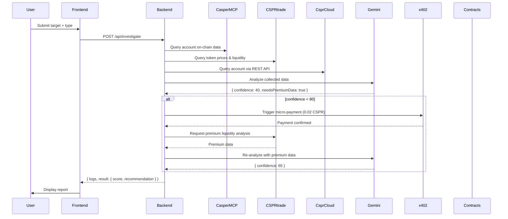

# 🏗️ Sentinel AI — Architecture Overview

Sentinel AI is composed of three layers — Frontend, Backend Agent, and On-Chain Smart Contracts — all interconnected through the Casper AI Toolkit infrastructure.

---

## Layers

### 1. Frontend (Next.js + CSPR.click)

The user interface layer, built with Next.js and styled-components.

- **CSPR.click Integration** — Users authenticate and connect their Casper Wallet via the `cspr.click` SDK without exposing private keys to the app.
- **Investigation Panel** — Accepts a target (Casper public key, contract hash, or URL) and investigation type (DeFi / RWA / NFT).
- **Live Agent Log** — Streams the agent's step-by-step reasoning to the UI via polling the `/api/investigate` endpoint response logs.
- **Results Dashboard** — Displays the final score (0–100), recommendation (INVEST / CAUTION / AVOID), tools used, and CSPR spent.

### 2. Backend Agent Orchestrator (Express + TypeScript)

The reasoning engine of Sentinel AI. Implements a **ReAct (Reason + Act)** loop powered by **Google Gemini AI**.

**Endpoint:** `POST /api/investigate`

**Tools used by the agent:**

| Tool | Source | Purpose |
|------|--------|---------|
| `csprCloudTools` | CSPR.cloud REST API | Account data, balance, deploy history |
| `casperMCPTools` | Casper MCP Server | On-chain queries via Model Context Protocol |
| `csprTradeTools` | CSPR.trade MCP | Token prices, liquidity pools, swap quotes |
| `x402Tools` | x402 Facilitator | Autonomous micro-payments for premium data |

**Agent loop:**
1. Collect free data from all available MCP and REST sources
2. Feed data to Gemini with a structured prompt → receive `{ confidence, findings, needsPremiumData, recommendation }`
3. If `needsPremiumData && confidence < 80` → trigger x402 payment → purchase premium data
4. Re-analyze with premium data → confidence increases
5. Synthesize and return final report

### 3. Smart Contracts (Odra Framework — Rust/WASM)

The on-chain trust layer deployed to Casper Testnet as **upgradeable** contracts.

**`Marketplace` contract**
- Allows data providers to register premium intelligence services
- Handles x402 payment verification and settlement via the x402 Facilitator
- Deployed as upgradeable — future versions publish under the same package hash

**`InvestigationRegistry` contract**
- Immutable ledger of completed investigations
- Records: target address, score, recommendation, timestamp, agent public key
- Enables verifiable, tamper-proof audit trail for all due diligence results

---

## Data Flow



---

## Directory Structure

```
sentinel-ai/
├── frontend/               # Next.js app (UI)
│   └── src/
│       ├── app/            # Next.js App Router pages
│       ├── components/     # React components
│       └── providers/      # CSPR.click wallet provider
│
├── backend/                # Express agent orchestrator
│   ├── src/
│   │   ├── server.ts       # Express app, routes, ReAct agent loop
│   │   └── tools/          # MCP & API tool wrappers
│   │       ├── casperMCP.ts
│   │       ├── csprCloudREST.ts
│   │       ├── csprTradeMCP.ts
│   │       └── x402Payment.ts
│   └── keys/               # Agent wallet (gitignored)
│
├── contracts/              # Odra smart contracts (Rust)
│   ├── src/
│   │   ├── marketplace.rs  # ServiceMarketplace module
│   │   └── registry.rs     # InvestigationRegistry module
│   ├── bin/
│   │   ├── build_contract.rs   # WASM build entry point
│   │   └── deploy.rs           # Testnet deployment binary
│   ├── wasm/               # Compiled WASM artifacts
│   └── casper_livenet.env  # Livenet config (no secrets)
│
└── docs/                   # Project documentation
```

---

## Key Design Decisions

**Why upgradeable contracts?**  
Using `InstallConfig::upgradable()` in Odra 2.8 means the contract package hash never changes across upgrades. Integrations built on top of Sentinel AI remain stable even as logic is improved.

**Why CSPR.cloud REST as a fallback?**  
Both the Casper MCP Server and CSPR.trade MCP require SSE (Server-Sent Events) for proper streaming handshakes. When the `fetch`-based client can't negotiate the SSE protocol, the agent falls back to the CSPR.cloud REST API — ensuring resilience without crashing.

**Why autonomous x402 payments?**  
The core innovation of the project. The agent decides *when* to spend money without human intervention — demonstrating true autonomy. The 80% confidence threshold makes this decision principled rather than arbitrary.
